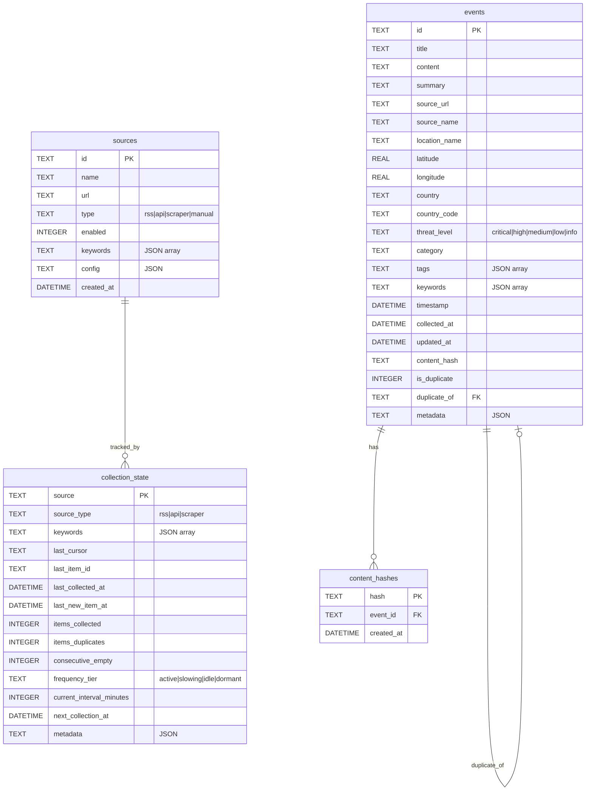

# Database Architecture

## Overview

Global Threat Map uses SQLite databases for storing collected threat intelligence data. Each topic has its own isolated database file for independent scaling and backup.

```
data/
├── cybersec.db      # Cybersecurity threats, breaches, vulnerabilities
├── diseases.db      # Disease outbreaks, health emergencies (Nipah, etc.)
├── military.db      # Military conflicts, defense intelligence
└── geopolitics.db   # Political events, sanctions, diplomatic incidents
```

## Entity Relationship Diagram



## Tables

### `events`

Stores all collected threat intelligence events.

| Column | Type | Description |
|--------|------|-------------|
| `id` | TEXT | Primary key, unique event identifier |
| `title` | TEXT | Event headline/title |
| `content` | TEXT | Full event content/body |
| `summary` | TEXT | AI-generated or extracted summary |
| `source_url` | TEXT | Original source URL |
| `source_name` | TEXT | Name of the source (e.g., "Reuters", "Valyu API") |
| `location_name` | TEXT | Human-readable location |
| `latitude` | REAL | Geographic latitude |
| `longitude` | REAL | Geographic longitude |
| `country` | TEXT | Country name |
| `country_code` | TEXT | ISO 3166-1 alpha-2 code |
| `threat_level` | TEXT | Severity: critical, high, medium, low, info |
| `category` | TEXT | Event category |
| `tags` | TEXT | JSON array of tags |
| `keywords` | TEXT | JSON array of matched keywords |
| `timestamp` | DATETIME | When the event occurred |
| `collected_at` | DATETIME | When we collected the event |
| `updated_at` | DATETIME | Last update timestamp |
| `content_hash` | TEXT | SHA256 hash for deduplication |
| `is_duplicate` | INTEGER | 1 if duplicate, 0 if original |
| `duplicate_of` | TEXT | ID of original event if duplicate |
| `metadata` | TEXT | Additional JSON metadata |

**Indexes:**
- `idx_events_timestamp` - For time-based queries
- `idx_events_threat_level` - For filtering by severity
- `idx_events_country_code` - For geographic filtering
- `idx_events_collected_at` - For incremental sync
- `idx_events_content_hash` - For deduplication lookups
- `idx_events_keywords` - For keyword search

### `collection_state`

Tracks the state of each data collector for incremental collection and adaptive frequency.

| Column | Type | Description |
|--------|------|-------------|
| `source` | TEXT | Primary key, unique source identifier |
| `source_type` | TEXT | Type: rss, api, scraper |
| `keywords` | TEXT | JSON array of keywords this collector tracks |
| `last_cursor` | TEXT | Pagination cursor for APIs |
| `last_item_id` | TEXT | ID of last processed item |
| `last_collected_at` | DATETIME | Last successful collection time |
| `last_new_item_at` | DATETIME | Last time new (non-duplicate) item was found |
| `items_collected` | INTEGER | Total items collected |
| `items_duplicates` | INTEGER | Total duplicates encountered |
| `consecutive_empty` | INTEGER | Consecutive collections with no new items |
| `frequency_tier` | TEXT | Current adaptive tier |
| `current_interval_minutes` | INTEGER | Current collection interval |
| `next_collection_at` | DATETIME | Scheduled next collection time |
| `metadata` | TEXT | Additional JSON metadata |

### `sources`

Configuration for data sources.

| Column | Type | Description |
|--------|------|-------------|
| `id` | TEXT | Primary key |
| `name` | TEXT | Human-readable source name |
| `url` | TEXT | Source URL (RSS feed, API endpoint, etc.) |
| `type` | TEXT | Source type: rss, api, scraper, manual |
| `enabled` | INTEGER | 1 if active, 0 if disabled |
| `keywords` | TEXT | JSON array of keywords to track |
| `config` | TEXT | Source-specific JSON configuration |
| `created_at` | DATETIME | When source was added |

### `content_hashes`

Lookup table for fast content-based deduplication.

| Column | Type | Description |
|--------|------|-------------|
| `hash` | TEXT | Primary key, SHA256 content hash |
| `event_id` | TEXT | Foreign key to events table |
| `created_at` | DATETIME | When hash was recorded |

## Adaptive Collection Frequency

The collector automatically adjusts polling frequency based on source activity:

```
┌─────────────────────────────────────────────────────────────────┐
│                    ADAPTIVE FREQUENCY FLOW                       │
├─────────────────────────────────────────────────────────────────┤
│                                                                  │
│   ┌──────────┐    New items found    ┌──────────┐               │
│   │  ACTIVE  │◄──────────────────────│   ANY    │               │
│   │  10 min  │                       │  TIER    │               │
│   └────┬─────┘                       └──────────┘               │
│        │                                                         │
│        │ 1-2 empty collections                                   │
│        ▼                                                         │
│   ┌──────────┐                                                   │
│   │ SLOWING  │                                                   │
│   │  30 min  │                                                   │
│   └────┬─────┘                                                   │
│        │                                                         │
│        │ 3-5 empty collections                                   │
│        ▼                                                         │
│   ┌──────────┐                                                   │
│   │   IDLE   │                                                   │
│   │  60 min  │                                                   │
│   └────┬─────┘                                                   │
│        │                                                         │
│        │ 6+ empty collections                                    │
│        ▼                                                         │
│   ┌──────────┐                                                   │
│   │ DORMANT  │                                                   │
│   │ 120 min  │                                                   │
│   └──────────┘                                                   │
│                                                                  │
└─────────────────────────────────────────────────────────────────┘
```

| Tier | Interval | Trigger |
|------|----------|---------|
| `active` | 10 min | New items found |
| `slowing` | 30 min | 1-2 consecutive empty collections |
| `idle` | 60 min | 3-5 consecutive empty collections |
| `dormant` | 2 hours | 6+ consecutive empty collections |

## Deduplication Strategy

### Exact Deduplication
- SHA256 hash of normalized `title + first 500 chars of content`
- Stored in `content_hashes` table for O(1) lookup

### Fuzzy Deduplication
- Jaccard similarity on word sets (threshold: 75%)
- Compares against last 24 hours of non-duplicate events
- Duplicates are stored but marked with `is_duplicate=1` and `duplicate_of` reference

```
┌─────────────────────────────────────────────────────────────────┐
│                    DEDUPLICATION FLOW                            │
├─────────────────────────────────────────────────────────────────┤
│                                                                  │
│   New Item                                                       │
│      │                                                           │
│      ▼                                                           │
│   ┌──────────────────┐                                           │
│   │ Generate Hash    │                                           │
│   │ (title+content)  │                                           │
│   └────────┬─────────┘                                           │
│            │                                                     │
│            ▼                                                     │
│   ┌──────────────────┐     YES    ┌──────────────────┐          │
│   │ Hash exists in   │──────────►│ SKIP (exact dup) │          │
│   │ content_hashes?  │            └──────────────────┘          │
│   └────────┬─────────┘                                           │
│            │ NO                                                  │
│            ▼                                                     │
│   ┌──────────────────┐     YES    ┌──────────────────┐          │
│   │ Similar content  │──────────►│ STORE as duplicate│          │
│   │ (>75% match)?    │            │ (is_duplicate=1)  │          │
│   └────────┬─────────┘            └──────────────────┘          │
│            │ NO                                                  │
│            ▼                                                     │
│   ┌──────────────────┐                                           │
│   │ STORE as new     │                                           │
│   │ (is_duplicate=0) │                                           │
│   └──────────────────┘                                           │
│                                                                  │
└─────────────────────────────────────────────────────────────────┘
```

## Usage

### Setup

```bash
# Initialize all databases
npm run db:setup
```

### Querying Events

```typescript
import { queryEvents, countEvents } from '$lib/server/db/events';

// Get recent high-threat events (excludes duplicates by default)
const events = queryEvents('diseases', {
  threatLevel: 'high',
  limit: 50,
  since: new Date(Date.now() - 24 * 60 * 60 * 1000) // last 24h
});

// Include duplicates if needed
const allEvents = queryEvents('diseases', {
  includeDuplicates: true
});

// Filter by keywords
const nipahEvents = queryEvents('diseases', {
  keywords: ['nipah', 'henipavirus']
});
```

### Processing Collected Items

```typescript
import {
  processCollectedItems,
  initCollectorState,
  getSourcesDueForCollection
} from '$lib/server/db/collector';

// Initialize a new collector
initCollectorState('diseases', 'valyu-nipah', 'api', ['nipah', 'outbreak']);

// Process collected items (handles dedup + adaptive frequency)
const result = processCollectedItems('diseases', 'valyu-nipah', [
  {
    title: 'New Nipah case reported in Kerala',
    content: 'Health officials confirmed...',
    source_url: 'https://example.com/news/123',
    threat_level: 'high',
    timestamp: new Date()
  }
]);

console.log(result);
// {
//   newItems: 1,
//   duplicates: 0,
//   total: 1,
//   nextCollectionAt: Date,
//   frequencyTier: 'active'
// }

// Get sources ready for collection
const dueSources = getSourcesDueForCollection('diseases');
```

## Event Processing Pipeline

Raw inputs from various sources (RSS, API, scrapers) are processed through the event processor to extract structured data.

```
┌─────────────────────────────────────────────────────────────────┐
│                    EVENT PROCESSING PIPELINE                     │
├─────────────────────────────────────────────────────────────────┤
│                                                                  │
│   Raw Input                                                      │
│   (text/RSS/API)                                                 │
│        │                                                         │
│        ▼                                                         │
│   ┌──────────────────┐                                           │
│   │ Normalize Input  │  Convert to standard format               │
│   └────────┬─────────┘                                           │
│            │                                                     │
│            ▼                                                     │
│   ┌──────────────────┐     ┌──────────────────┐                 │
│   │ Keyword Filter   │────►│ Skip irrelevant  │                 │
│   │ (optional)       │     └──────────────────┘                 │
│   └────────┬─────────┘                                           │
│            │                                                     │
│            ▼                                                     │
│   ┌──────────────────┐                                           │
│   │ OpenAI Extract   │  Extract structured fields:               │
│   │ (with fallback)  │  - title, summary                        │
│   └────────┬─────────┘  - threat_level, category                │
│            │            - location, country                      │
│            │            - entities, keywords                     │
│            ▼                                                     │
│   ┌──────────────────┐                                           │
│   │ Geocode Location │  Resolve lat/lng from location           │
│   └────────┬─────────┘                                           │
│            │                                                     │
│            ▼                                                     │
│   ┌──────────────────┐                                           │
│   │ CollectedItem    │  Ready for deduplication & storage       │
│   └──────────────────┘                                           │
│                                                                  │
└─────────────────────────────────────────────────────────────────┘
```

### Supported Input Types

```typescript
// Raw text input
const textInput: RawTextInput = {
  type: 'text',
  content: 'Full article or news content...',
  source_url: 'https://example.com/article',
  source_name: 'Reuters',
  published_at: '2024-01-15T10:00:00Z'
};

// RSS feed item
const rssInput: RawRSSItem = {
  type: 'rss',
  title: 'Nipah outbreak reported in Kerala',
  description: 'Health officials confirmed...',
  content: 'Full article content...',
  link: 'https://example.com/news/123',
  pubDate: 'Mon, 15 Jan 2024 10:00:00 GMT',
  source_name: 'WHO News'
};

// API response (e.g., Valyu)
const apiInput: RawAPIResponse = {
  type: 'api',
  title: 'Article title',
  content: 'Article content',
  url: 'https://example.com',
  source: 'Valyu',
  date: '2024-01-15'
};
```

### Processing Raw Inputs

```typescript
import { processRawInput, processRawInputs } from '$lib/server/event-processor';
import { processCollectedItems } from '$lib/server/db/collector';

// Process single input
const item = await processRawInput('diseases', {
  type: 'text',
  content: 'A new Nipah virus case was confirmed in Kozhikode, Kerala today...',
  source_name: 'Health Ministry'
}, ['nipah', 'outbreak']);

// item is now a CollectedItem with extracted fields:
// {
//   title: 'New Nipah virus case confirmed in Kerala',
//   summary: 'Health Ministry confirms Nipah case in Kozhikode...',
//   threat_level: 'high',
//   category: 'outbreak',
//   location_name: 'Kozhikode',
//   latitude: 11.2588,
//   longitude: 75.7804,
//   country: 'India',
//   country_code: 'IN',
//   ...
// }

// Process multiple inputs
const items = await processRawInputs('diseases', rawInputs, keywords);

// Store with deduplication
const result = processCollectedItems('diseases', 'my-source', items);
```

## File Locations

```
frontend/
├── data/                              # SQLite database files
│   ├── cybersec.db
│   ├── diseases.db
│   ├── military.db
│   └── geopolitics.db
├── scripts/
│   └── db-setup.ts                    # Database initialization script
└── src/lib/server/
    ├── db/
    │   ├── schema.ts                  # Table schemas & constants
    │   ├── index.ts                   # Connection manager
    │   ├── events.ts                  # Event CRUD operations
    │   ├── collection-state.ts        # Collection state tracking
    │   └── collector.ts               # Adaptive collector logic
    ├── event-processor.ts             # Raw input → structured event
    └── collectors/
        └── example-collector.ts       # Example collector implementations
```
